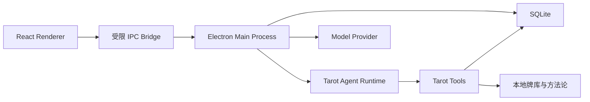

# Windows 本地技术架构

## 1. 架构结论

项目使用单机桌面架构：



不启动本地 HTTP 服务，不使用云数据库，也不要求用户登录。

## 2. 技术栈

| 层级 | 技术 |
|---|---|
| 桌面容器 | Electron |
| UI | React + TypeScript + Vite |
| 设计系统 | `@astryxdesign/core` + 项目自有 Tarot Theme |
| 状态管理 | Zustand 或轻量 React Store |
| 数据校验 | Zod |
| 本地数据库 | SQLite |
| AI 调用 | OpenAI SDK 或兼容接口，位于主进程 |
| 普通动画 | Framer Motion |
| 3D 与粒子 | Three.js + React Three Fiber + Drei |
| 单元测试 | Vitest |
| 桌面端到端测试 | Playwright Electron |
| 打包 | electron-builder |

主项目只使用 TypeScript。现有 Python 脚本作为公式原型，验证一致后移植并用测试锁定行为。

## 3. 进程边界

### 3.1 Electron 主进程

负责：

- 窗口生命周期；
- SQLite；
- API Key 加解密；
- 模型请求与流式响应；
- Agent Runtime；
- 本地文件读取；
- 导出结果；
- IPC 参数校验。

### 3.2 Preload

只暴露明确允许的接口：

```ts
interface TarotDesktopApi {
  sessions: {
    list(): Promise<SessionSummary[]>;
    create(): Promise<Session>;
    rename(id: string, title: string): Promise<void>;
    remove(id: string): Promise<void>;
  };
  readings: {
    createDraft(input: CreateReadingInput): Promise<ReadingDraft>;
    shuffle(id: string): Promise<ShuffledDeck>;
    updateSelection(id: string, cardIndexes: number[]): Promise<void>;
    confirm(id: string): Promise<ConfirmedReading>;
    run(id: string): Promise<void>;
    cancel(id: string): Promise<void>;
  };
  settings: {
    get(): Promise<PublicSettings>;
    save(input: SettingsInput): Promise<void>;
    testConnection(): Promise<ConnectionTestResult>;
  };
  events: {
    subscribe(listener: (event: AppEvent) => void): () => void;
  };
}
```

Renderer 不能访问 Node.js、数据库文件或明文 API Key。

### 3.3 React Renderer

负责：

- 会话 UI；
- 选牌状态显示；
- 卡带与翻牌动画；
- 流式文本渲染；
- 工具过程展示；
- 设置表单。

Renderer 不承担可信计算。最终牌序、方向和公式结果必须由主进程返回。

选牌交互必须使用标准 Pointer Events，使同一组件同时支持鼠标、触摸和触控笔。滚轮与键盘属于桌面增强入口，不能成为完成选牌的唯一方式。

## 4. 本地数据位置

生产数据放在 Electron `userData`：

```text
%APPDATA%\TarotAgent\
├── tarot.sqlite
├── logs\
├── exports\
└── backups\
```

牌图和初始内容作为只读资源随应用打包：

```text
resources/
├── cards.json
├── methodology.txt
├── model.md
└── cards/*.webp
```

运行时只通过 `AssetResolver` 获取资源 URL，业务代码不拼接开发或生产路径。开发环境从 Vite 资源目录读取；打包环境从 Electron `process.resourcesPath` 下的只读资源读取。构建阶段将原始中文图片名复制为稳定的 ASCII `card_id.webp`，`cards.json` 只引用稳定 ID 路径。

## 5. API Key 与安全

- 使用 Electron `safeStorage` 加密 API Key；
- Windows 上依赖当前系统账户的加密能力；
- 明文 Key 只在主进程内短暂使用；
- `contextIsolation: true`；
- `nodeIntegration: false`；
- 所有 IPC 输入通过 Zod 校验；
- Renderer 不允许传入任意文件路径或任意模型请求；
- 默认不收集遥测；
- 日志不得写入 API Key 或完整授权头。

## 6. 模型连接

第一版提供一个连接配置：

```ts
interface ModelConnection {
  provider: "openai" | "openai-compatible";
  baseUrl?: string;
  model: string;
  encryptedApiKey?: string;
}
```

`openai-compatible` 为未来的本地模型或兼容网关预留，但第一版只要求 OpenAI 路径通过验收。

模型请求必须：

- 支持流式输出；
- 使用结构化输出校验；
- 设置超时和取消；
- 记录模型名称、用量与错误类别；
- 失败后允许重试，但不得重新抽牌；
- 重试时复用已经确认的牌面和计算结果。

默认错误策略：

- 认证和配置错误不自动重试；
- 限流、网络中断和服务端错误最多自动重试两次，使用指数退避与抖动；
- 超时和用户取消不自动继续；
- 结构化输出失败允许一次受约束的修复请求，仍失败则进入 `failed`；
- 所有重试创建新的 `runId`，但复用同一 `readingId` 和输入快照。

## 7. 参考 Maka 的边界

保留这些思想：

- 本地优先；
- Electron + React + TypeScript；
- SQLite 作为运行事实来源；
- 消息、工具调用、工具结果和终止状态形成事件；
- UI 是事件的展示；
- 模型连接与 Runtime 分离；
- 崩溃后可以读取已提交事件恢复界面。

不复制这些能力：

- Shell 与文件工具；
- 通用权限引擎；
- Computer Use；
- 多 Provider 完整矩阵；
- MCP；
- TUI、CLI、Headless；
- 多 Agent Graph；
- 长任务续跑；
- 上下文压缩与复杂恢复协议；
- 自我迭代。

## 8. 建议目录

```text
apps/
└── desktop/
    └── src/
        ├── main/
        │   ├── index.ts
        │   ├── window.ts
        │   ├── ipc.ts
        │   └── adapters/
        │       ├── sqlite-reading-repository.ts
        │       ├── electron-credential-store.ts
        │       ├── openai-model-provider.ts
        │       └── electron-asset-resolver.ts
        ├── preload/
        │   └── index.ts
        └── renderer/
            ├── App.tsx
            ├── pages/
            ├── effects/
            └── store/
packages/
├── core/
│   └── src/
│       ├── cards/
│       ├── deck/
│       ├── scoring/
│       ├── momentum/
│       ├── reading-state/
│       └── schemas/
├── runtime/
│   └── src/
│       ├── ports/
│       ├── workflow/
│       ├── prompt/
│       └── events/
├── ui/
│   └── src/
│       ├── components/
│       ├── reading/
│       └── responsive/
└── tarot-theme/
    └── src/
        ├── tokens.ts
        └── tarotTheme.ts
scripts/
├── validate-content.ts
└── generate-card-data.ts
tests/
└── fixtures/
```

第一版只创建 `apps/desktop`，但共享逻辑从一开始放入 `packages/`。未来 `apps/mobile` 只增加 Capacitor 容器和移动 adapters，不复制 Core、Runtime 或业务 Schema。

## 9. 架构参考

- [Maka Agent README](https://github.com/maka-agent/maka-agent/blob/main/README.md)：本地优先、Electron 桌面入口与 SQLite 存储方向；
- [Maka Backend Architecture](https://github.com/maka-agent/maka-agent/blob/main/ARCHITECTURE.md)：事件日志、Runtime 和 UI 投影思想；
- [OpenAI Codex App](https://openai.com/index/introducing-the-codex-app/)：桌面 Agent 的会话、任务与可检查过程形态。

这些资料仅作为架构和交互参考。本项目不依赖 Maka 源码，也不复制 Codex 的通用编码 Agent 能力。

Astryx 的主题、组件与 CSS 层级约定见 [Astryx UI 与视觉规范](05-ui-design-system.md)。业务组件应在 Astryx 之上组合，不建立平行的第二套按钮、表单、弹窗、颜色、圆角或间距体系。

## 10. 移动端后路与平台边界

第一版不安装 Capacitor，也不创建 Android 或 iOS 工程。移动端后路通过代码边界保留：

```text
packages/core      纯 TypeScript 牌库、公式、状态机和 Schema
packages/runtime   Agent 工作流和平台接口
packages/ui        React + Astryx 响应式 UI
apps/desktop       Electron 与 Windows adapters
apps/mobile        未来的 Capacitor 容器与移动 adapters
```

`packages/core` 不允许依赖：

```text
electron
window
ipcRenderer
node:fs
Windows 路径
SQLite 具体驱动
safeStorage
```

平台能力通过接口提供：

- `ReadingRepository`；
- `CredentialStore`；
- `ModelProvider`；
- `EventStream`；
- `ExportService`。

当前由 Electron 实现，未来可由 Capacitor 实现。桌面开发阶段只要求 Astryx UI 在窄窗口下保持可用，并通过 Pointer Events 支持模拟触摸；不要求在没有触摸屏的 Windows 设备上完成物理触摸验收。

摄像头手势如果进入未来版本，应作为独立的 `GestureInputAdapter`，只产生浏览、选择、取消和确认意图，不能直接修改数据库或绕过选牌状态机。

## 11. 依赖、打包与发布约束

- 使用单一包管理器并提交 lockfile；推荐 `pnpm` 与 `pnpm-lock.yaml`；
- 核心依赖使用经过验证的明确版本，不在生产构建中使用未锁定的 `latest`；
- Astryx 使用公开的 `@astryxdesign/core` 和项目自有 Tarot Theme，不依赖 Maka 私有 UI 包；
- Electron 主版本升级单独处理，升级后运行 IPC、安全、SQLite、资源路径和真实窗口测试；
- 开发版、安装版和便携版默认使用同一 `%APPDATA%\TarotAgent\` 数据目录，除非用户明确启用真正的便携数据模式；
- 项目仅供个人使用时，Windows 代码签名不是 MVP 阻塞项，但发布说明必须提示可能出现 SmartScreen 警告；
- 若未来对外分发，再把正式代码签名纳入发布门槛。

数据来源、生成、备份、日志和版本迁移详见 [数据来源、版本与本地运维](06-data-operations.md)。
